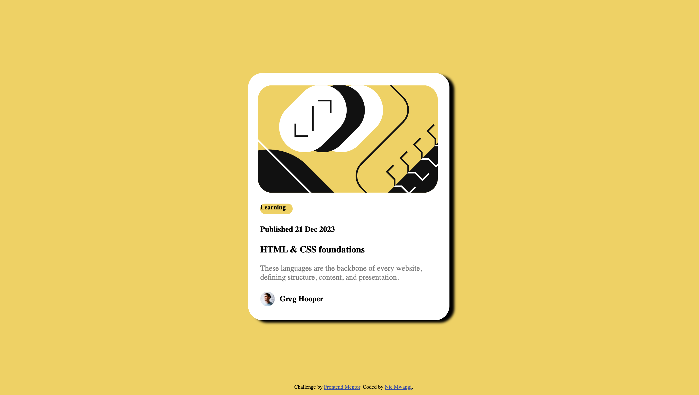

# Frontend Mentor - Blog preview card solution

This is a solution to the [Blog preview card challenge on Frontend Mentor](https://www.frontendmentor.io/challenges/blog-preview-card-ckPaj01IcS). Frontend Mentor challenges help you improve your coding skills by building realistic projects. 

## Table of contents

- [Overview](#overview)
  - [The challenge](#the-challenge)
  - [Screenshot](#screenshot)
  - [Links](#links)
- [My process](#my-process)
  - [Built with](#built-with)
  - [What I learned](#what-i-learned)
  - [Continued development](#continued-development)
  - [Useful resources](#useful-resources)
- [Author](#author)


## Overview

### The challenge

Users should be able to:

- See hover and focus states for all interactive elements on the page

### Screenshot




### Links

- Solution URL: [Add solution URL here](https://your-solution-url.com)
- Live Site URL: [Add live site URL here](https://your-live-site-url.com)

## My process

### Built with

- Semantic HTML5 markup
- CSS custom properties
- Flexbox
- CSS Grid
- Mobile-first workflow


### What I learned

I learned how to better orient my div elements through the use of the margin element. Also I improved on using figma designs to better help with the development of my project. Additionally, I was able to perfectly align my text with one of the images provided while keeping both elements inline.

To see how you can add code snippets, see below:

```html
<div class="center">
      
      <span class="img-text"><b>Greg Hooper</b></span>
    </div>

```
```css
.la {
    background-color: hsl(47, 88%, 63%);
    width: 5em;
    height: 3.5ex;
    border: 2px;
    border-radius: 10px;
}
```


### Continued development

I want to focus on how I can better replicate the images I see into my own code. I've only just started, but I'm so frustrated that my project doesn't perfectly match the challenge.


### Useful resources

- [Mozilla Developer Network](https://developer.mozilla.org/en-US/) - This website is one of the resources online for front end developers. If there's a concept, code, or element you don't understand, you can probably find it at this site. This is where I got better equiped at understanding margin and padding.
- [W3schools](https://www.w3schools.com/) - This is a great website for both front end and back end programming languages, I regulary visit here to refresh concepts that I may have forgotten


## Author

- Website - [Nic Mwangi](https://saintnic84.github.io/)
- Frontend Mentor - [@saintnic84](https://www.frontendmentor.io/profile/saintnic84)


